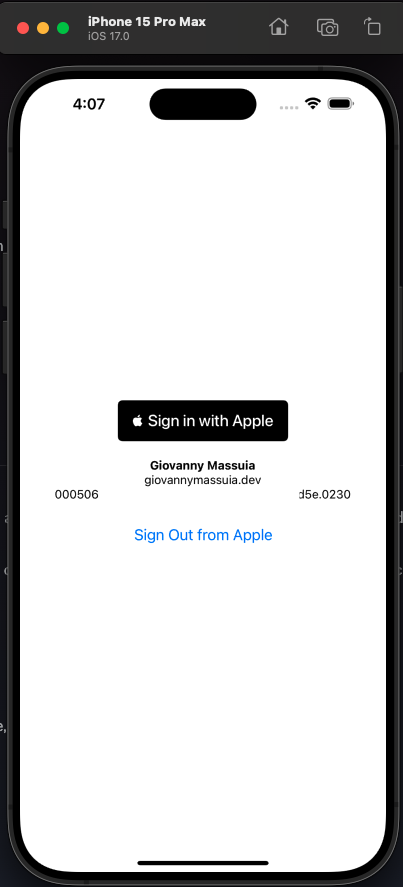
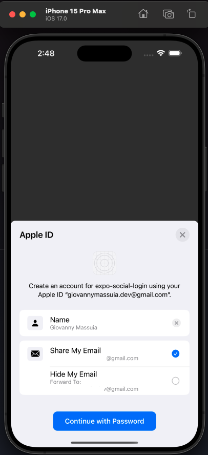
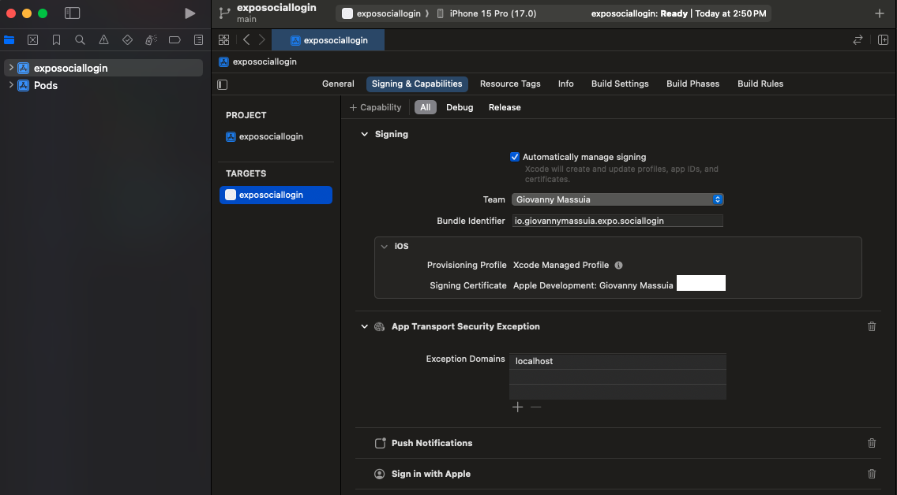

# Expo iOS and Apple Sign In

**Docs:**

> -   https://supabase.com/docs/guides/auth/social-login/auth-apple?platform=react-native
> -   https://developer.apple.com/documentation/authenticationservices
> -   https://docs.expo.dev/versions/latest/sdk/apple-authentication/

**Git commit:** This commit contains the changes in this section:

> -   [apple signin basic configuration #6f39262](https://github.com/giovannymassuia/expo-social-login/commit/6f39262eed954c2494253c44735ef5b5d87e8f6a)

## 1. Install dependencies

Install Expo Apple Authentication: `npx expo install expo-apple-authentication`

Install Async Storage: `npx expo install @react-native-async-storage/async-storage`

::: tip
We will need to use `Async Storage` to store the the user info, because the `Apple Sign In` doesn't return the user info in the callback.

-   [utils/AsyncStorage.ts](https://github.com/giovannymassuia/expo-social-login/blob/main/utils/AsyncStorage.ts)

:::

## 2. Setup iOS project

To enable the Sign In with Apple capability in your app, set the `ios.usesAppleSignIn` property to true in your project's app config.

Also need to add the plugin.

```json
// app.json
{
    // ...
    "expo": {
        // ...
        "ios": {
            // ...
            "usesAppleSignIn": true
        },
        // ...
        "plugins": [
            // ...
            "expo-apple-authentication"
        ]
    }
}
```

## 3. Build the app and run on iOS

Then run the following to generate the native project directories for iOS:

-   `npx expo prebuild --platform ios`
-   `npx expo run:ios`

## 4. Apple Sign In component

-   [components/AppleSignIn.tsx](https://github.com/giovannymassuia/expo-social-login/blob/main/components/AppleSignIn.tsx)

Add the component to `App.tsx`:

```tsx
// App.tsx
...
{Platform.OS === 'ios' && <AppleSignIn />}
...
```



## Points of attention for Apple Sign In and iOS

::: tip
The name and last of a user is only available in the first sign in, after that it will be `null`.
Also, this image to `create an accoutn` will also only show in the first sign in.

<details>
<summary>screenshot</summary>

</details>

The full name is only shown in the first sign in, after that it will be `null`.
Make sure you have the `fullName` stuff from the `response` object.

```json
"fullName": {
    "middleName": null,
    "nameSuffix": null,
    "givenName": "Giovanny",
    "familyName": "Massuia",
    "nickname": null,
    "namePrefix": null
  },
```

:::

::: tip
Make sure you have in xcode the following: `Sign In with Apple` added to the `Signing & Capabilities` tab.

<details>
<summary>screenshot</summary>

</details>
:::
