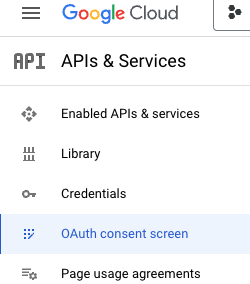
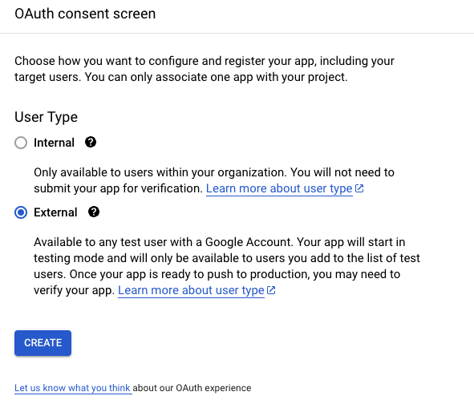
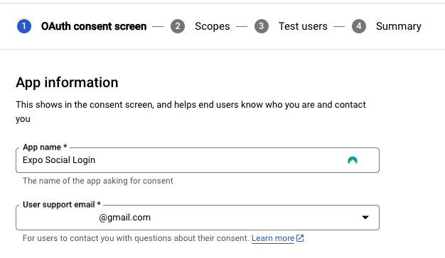
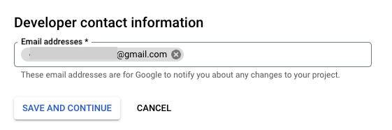
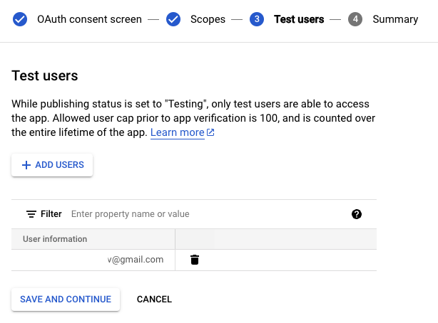
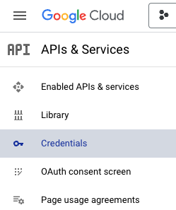
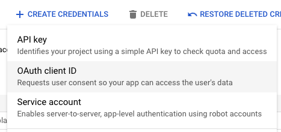
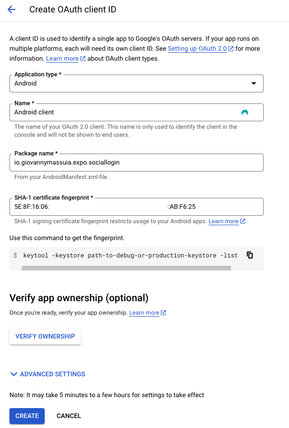
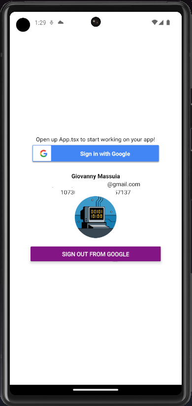

# Expo Android and Google Sign In

**Docs:**

> -   https://supabase.com/docs/guides/auth/social-login/auth-google?platform=react-native
> -   https://github.com/react-native-google-signin/google-signin#expo-installation
> -   https://react-native-google-signin.github.io/docs/setting-up/expo

**Git commit:** This commit contains the changes in this section:

> -   [google sign basic configuration #8645b99](https://github.com/giovannymassuia/expo-social-login/commit/8645b991342eb6211a4cc5dc8f8bd1e76a6837f7)

## 1. Install dependencies

`npx expo install @react-native-google-signin/google-signin`

::: warning
At the moment of this blog writing, the latest version of `@react-native-google-signin/google-signin` is `11.0.0`, but it has a bug that prevents the **iOS** from building. So we need to install the previous version `10.1.0` instead.

```bash
npm install @react-native-google-signin/google-signin@10.1.0
```

:::

## 2. Configure Plugin

```json
// app.json
{
    "expo": {
        // ...
        "plugins": ["@react-native-google-signin/google-signin"]
    }
}
```

## 3. Build the app and run on Android

Then run the following to generate the native project directories for android:

-   `npx expo prebuild --platform android`
-   `npx expo run:android`

## 4. Google Console API

-   Go to: https://console.cloud.google.com/apis/credentials
-   Create a project if you don't have one

### OAuth consent screen:

<details>
In [OAuth consent screen](https://console.cloud.google.com/apis/credentials/consent)

<details>
<summary>screenshot</summary>

</details>

-   Select `External` and click `Create`
     <details>
     <summary>screenshot</summary>
     
     </details>

-   Just Fill in the required fields for now and click `Save and Continue`
     <details>
     <summary>screenshot</summary>
     
     
     </details>

-   No need to add any `scopes` for now, click `Save and Continue`

    -   Add test users if you want, click `Save and Continue`

        > _While publishing status is set to "Testing", only test users are able to access the app. Allowed user cap prior to app verification is 100, and is counted over the entire lifetime of the app._

        <details>
        <summary>screenshot</summary>
        
        </details>

    -   Click `Back to Dashboard`

</details>

### Create Credentials:

<details>

In [Credentials](https://console.cloud.google.com/apis/credentials)

<details>
<summary>screenshot</summary>

</details>

-   Click `Create Credentials` and select `OAuth client ID`
     <details>
     <summary>screenshot</summary>
     
     </details>

-   Select `Android` and fill in the required fields and click `Create`

    -   **Package name:** Use the one from `app.json` in `expo.android.package`
    -   **SHA-1 certificate fingerprint:** Run `keytool -keystore android/app/debug.keystore -list -v` and copy the SHA-1 value

        -   Password: `android`

     <details>
     <summary>screenshot</summary>
     
     </details>

-   No need to copy the `Client ID` for now

</details>

## 5. Google Sign In component

-   [components/GoogleSignIn.tsx](https://github.com/giovannymassuia/expo-social-login/blob/main/components/GoogleSignIn.tsx)

Add the component to `App.tsx`:

```tsx
// App.tsx
...
{Platform.OS === 'android' && <GoogleSignIn />}
...
```


