# Expo Supabase Auth Config

**Docs:**

> -   https://supabase.com/docs/reference/javascript/initializing?example=react-native-options-async-storage
> -   https://supabase.com/docs/guides/auth/social-login/auth-google?platform=react-native
> -   https://supabase.com/docs/guides/auth/social-login/auth-apple?platform=react-native

## Supabase Auth Config

-   Create and account on https://supabase.com
-   Create a new project
-   Go to `Project Settings > API`
-   Copy the `URL` and `Key` and add it to the `.env` file as below (`.env.example`):

    ```bash
    EXPO_PUBLIC_SUPABASE_URL=<url>
    EXPO_PUBLIC_SUPABASE_KEY=<key>
    ```

    <details>
    <summary>screenshot</summary>
    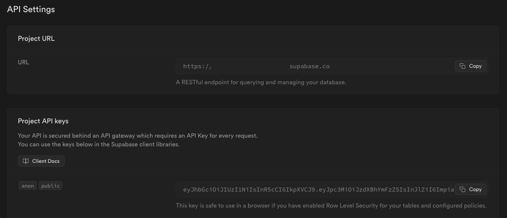
    </details>

## Supabase Google Sign In

### Google Console API

<details>

-   Go to: https://console.cloud.google.com/apis/credentials
-   Select the project you created before
-   Click on `Create Credentials` and select `OAuth client ID`
-   Select `Web application` and fill in the required fields and click `Create`
    <details>
    <summary>screenshot</summary>
    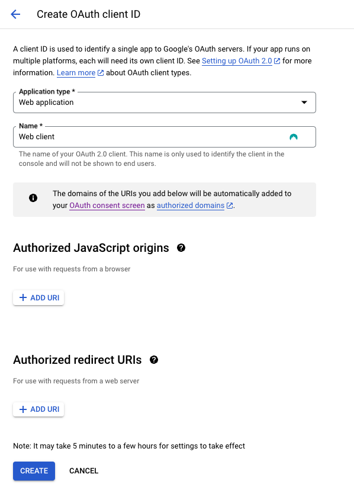
    </details>
-   Copy the `Client ID` and add it to the `.env` file as below (`.env.example`):

    ```bash
    EXPO_PUBLIC_GOOGLE_WEB_CLIENT_ID=<client-id>
    ```

-   Save the `Client Secret` for later. You will need it to configure the `Supabase Google Provider`

</details>

### Supabase Google Config

<details>

-   Go to `Authentication > Providers`
-   Enable `Google` and add the `Client ID` and `Client Secret` from the `Google Console API` section above
    <details>
    <summary>screenshot</summary>
    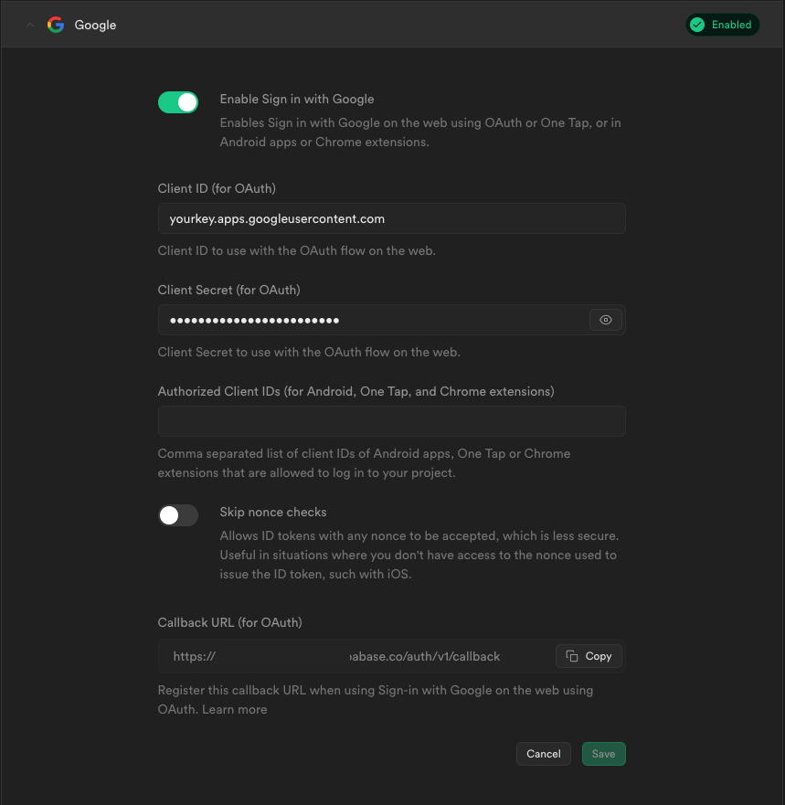
    </details>
-   Click `Save`

</details>

## Supabase Apple Sign In Config

### Apple Developer Portal config

<details>

<br/>

#### 1. Create an App ID

<details>

-   Go to https://developer.apple.com/account/resources/identifiers
-   Click on `Identifiers` and then `+`
    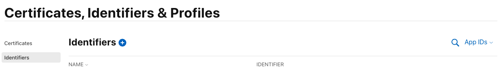
-   Select `App IDs` and click `Continue`
    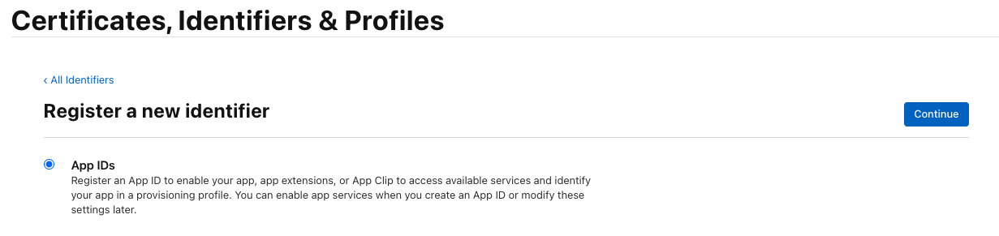
-   Select `App` and click `Continue`
    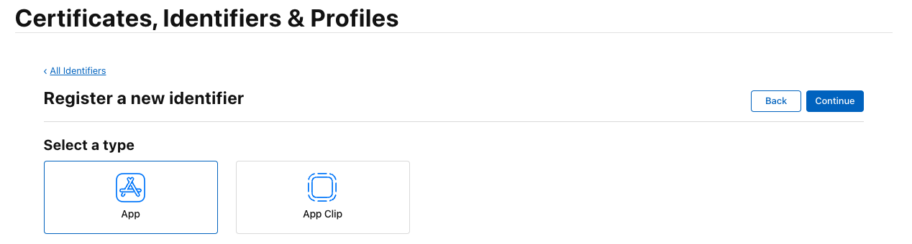
-   Fill in the required fields:
    -   **Description:** Enter a description for your App ID
    -   **Bundle ID:** Use the one from `app.json` in `expo.ios.bundleIdentifier`
        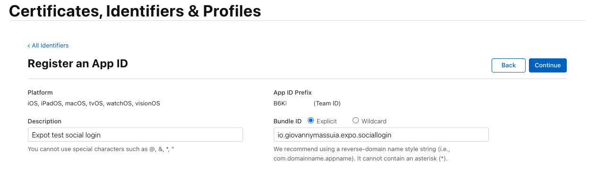
    -   **Capabilities:** Select `Sign In with Apple`
        
    -   Click `Continue` and then `Register`

::: info
If you already have an App ID, you can edit it and add the `Sign In with Apple` capability.
:::

</details>

<br/>

#### 2. Create a Service ID

<details>

-   Go to https://developer.apple.com/account/resources/identifiers
-   Click on `Identifiers` and then `+`
    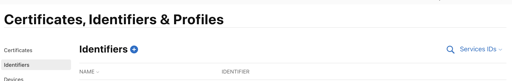
-   Select `Services IDs` and click `Continue`
    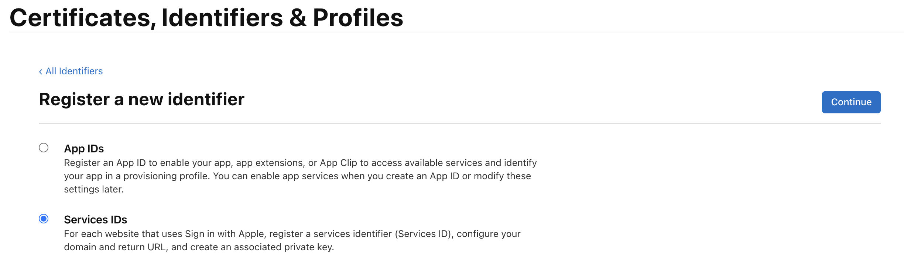
-   Fill in the required fields:
    -   **Description:** Enter a description for your Service ID
    -   **Identifier:** Use the one from `app.json` in `expo.ios.bundleIdentifier` with a suffix of `service`
        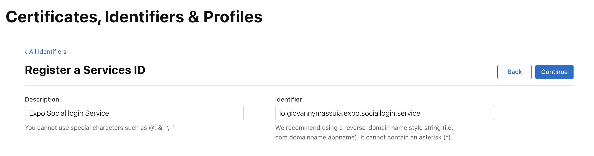
    -   Click `Continue` and then `Register`
-   Go back to the `Identifiers` page and select the `Service ID` you just created
    -   Select `Sign In with Apple` and click `Configure`
        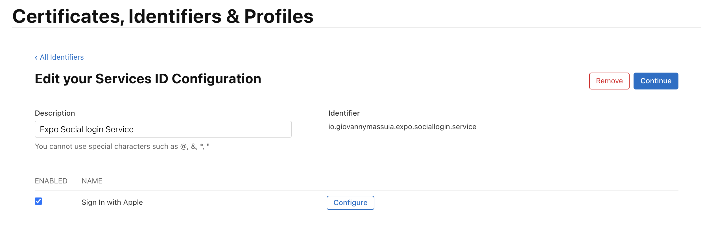
    -   Select the App ID you created before as the `Primary App ID` and click `Save`
    -   Add to `Domains and Subdomains` the `URL` from the `Supabase Auth Config` section above
    -   Add to `Return URLs` the Supabase `URL` with the path `/auth/v1/callback`
        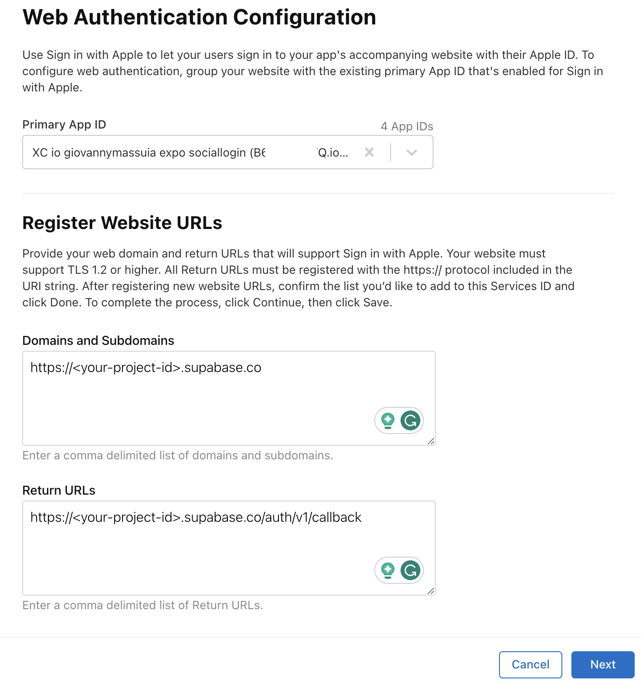
    -   Click `Next` and then `Done` to close the modal
    -   Click `Continue` and then `Save`

</details>

<br/>

#### 3. Create a Key

<details>

-   Go to https://developer.apple.com/account/resources/authkeys/
-   Click on `Keys` and then `+`
    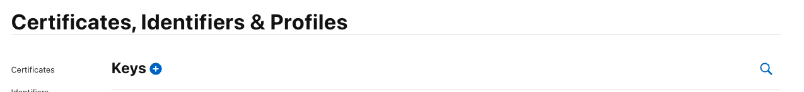
-   Fill in the required fields:
    -   **Key Name:** Enter a name for your key
    -   **Sign In with Apple:** Select the `Sign In with Apple` capability
        -   Click `Configure` and select the App ID you created before
            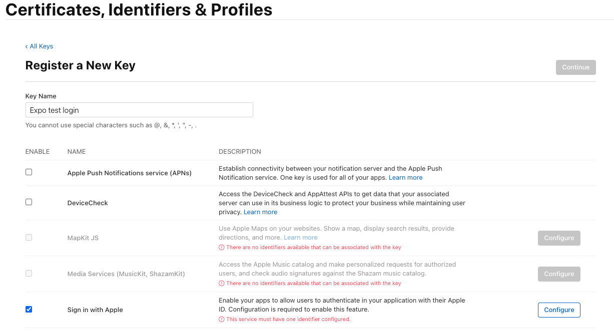
    -   Click `Continue` and then `Register`
-   Download the `.p8` file
    -   We will need to create a jwt token with this file later

</details>

</details>

### Supabase Apple Config

<details>

-   Go to https://supabase.com/docs/guides/auth/social-login/auth-apple#configuration-web
    -   Here we wil luse the `.p8` file we downloaded from the `Apple Developer Portal` section above to generate a `jwt token`
    -   Upload the file and enter the `Account ID` and `Service ID` from the `Apple Developer Portal` section above
        -   `Account ID` can be found at the top right corner of the `Apple Developer Portal` page
        -   `Service ID` can be found in the `Service ID` page. It's the `Identifier` field
-   Go to `Authentication > Providers`
-   Enable `Apple`
    -   Add the `Service ID` and `Secret Key (jwt)`
    -   Add to the `Authorized Client IDs` the `App ID` you created before. It should be the same as the `Bundle ID` in `app.json` in `expo.ios.bundleIdentifier`.
        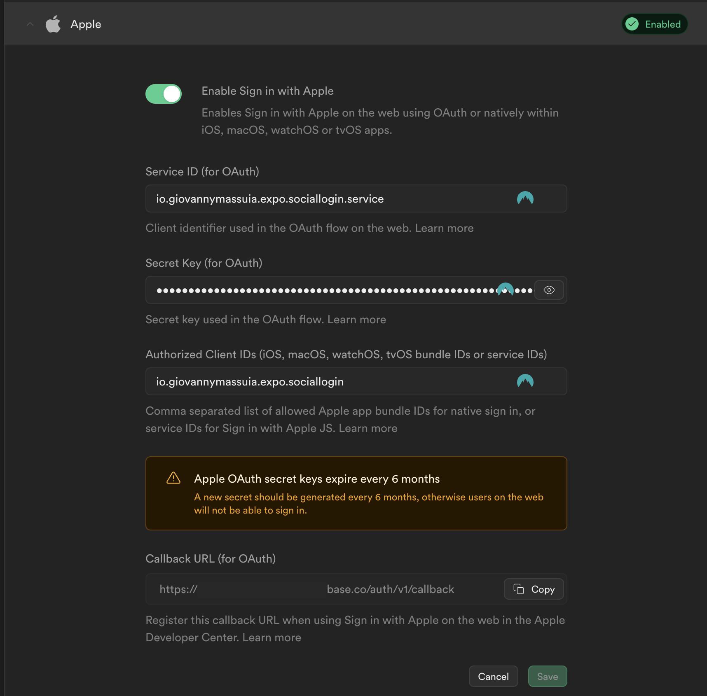

</details>

## Supabase Client config

> git commit: [supabase config #b5ae9b5](https://github.com/giovannymassuia/expo-social-login/commit/b5ae9b55f12bc439dea5e7ffd72e91408518c061)

-   In the project, install `supbase-js` and required dependencies:

`npx expo install @supabase/supabase-js @react-native-async-storage/async-storage react-native-url-polyfill`

-   create a `supabase` client: [utils/Supabase.ts](https://github.com/giovannymassuia/expo-social-login/blob/main/utils/Supabase.ts)

### Google Sign In with Supabase

-   Modify the `App.tsx` and `GoogleSignIn.tsx` to use the `supabase` client:
    -   Follow the changes on this [commit](https://github.com/giovannymassuia/expo-social-login/commit/3003de7a4e48428a07bb540c91460e75c49ee434)

### Apple Sign In with Supabase

-   Modify the `App.tsx` and `AppleSignIn.tsx` to use the `supabase` client:
    -   Follow the changes on this [commit](https://github.com/giovannymassuia/expo-social-login/commit/4a50628020d81c4366d521d17355f70829267fc8)
